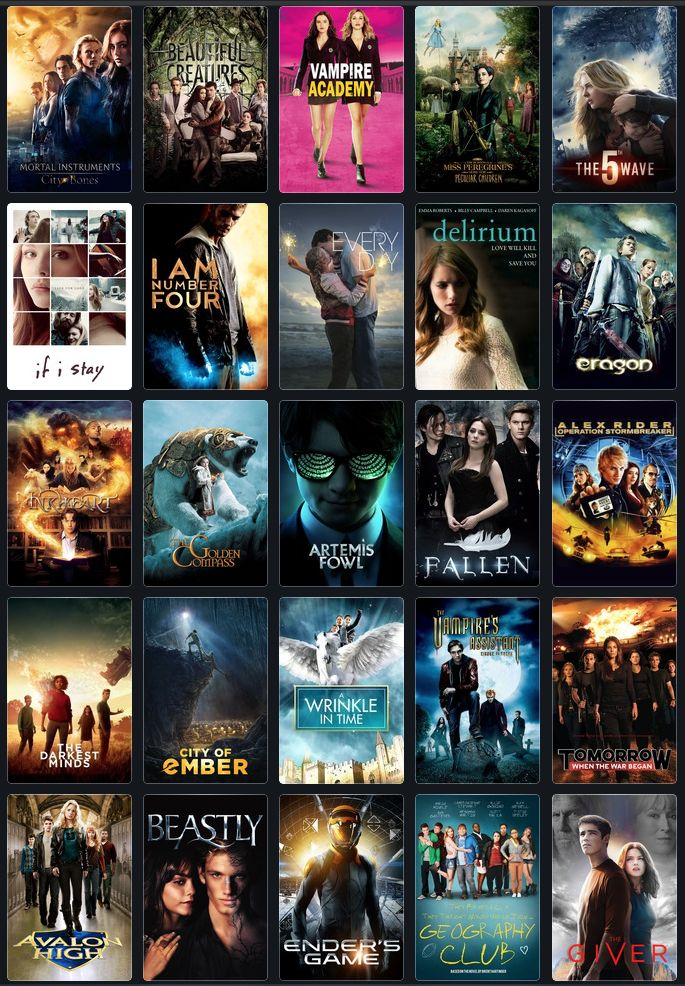

# Movie Rating Prediction Project

## Table of Contents

- [Project Overview](#project-overview)
- [Dataset](#dataset)
- [Project Structure](#project-structure)
- [Project Dependencies](#project-dependencies)
- [Project Workflow](#project-workflow)
- [Results and Insights](#results-and-insights)
- [Conclusion and Next Steps](#conclusion-and-next-steps)
- [Acknowledgments](#acknowledgments)
- [Contact Information](#contact-information)

## Project Overview

This repository contains the documentation and code for the Movie Rating Prediction project, aimed at predicting the ratings of movies. The goal is to provide valuable insights and recommendations to stakeholders in the film industry.

## Dataset

The dataset used for this project is sourced from Kaggle.com, and it contains information about various movie attributes, including features like release year, genre, Directors, and Votes. The dataset comprises 15000+ rows and  10 columns.

## Project Structure

The repository is structured as follows:
1. **images/**: Includes images used in the README.
2. **templates**: Contains the index.html and results.html.
3. **app.py**: Contains the flask app codes.
4. **Data/**: Contains the dataset used in this project.
5. **ipynb notebook/**: Contains Jupyter notebook with the full project code.
6. **README.md**: Provides an overview of the project.

## Project Dependencies

This project is implemented in Python and relies on the following libraries:

- Pandas
- NumPy
- Matplotlib
- Seaborn
- Scikit-Learn

Please ensure you have these libraries installed or import them before running the code to avoid errors.

## Project Workflow

The project followed a structured workflow:

1. **Data Preparation**: The dataset was cleaned and prepared, addressing missing values and data types.
2. **Exploratory Data Analysis**: Patterns and trends were identified through data visualization and analysis.
3. **Modeling**: Predictive models were built using algorithms such as Linear Regression and Decision Trees.
4. **Model Evaluation**: Models were evaluated using various metrics, and the best model was selected.
5. **Hyperparameter Tuning**: The best model's hyperparameters were fine-tuned to improve accuracy.
6. **Insights and Recommendations**: Insights were drawn, and data-driven recommendations were provided to stakeholders.
7. **Conclusion and next steps**: A summary of the project's findings and the key factors influencing movie ratings.

## Results and Insights

The analysis of movie ratings provided insights into the key factors influencing a movie's rating. Notable findings include:

- Genre Impact on Ratings: The choice of movie genre significantly influences ratings. Combinations of genres like history and romance, documentary and family, and music documentaries tend to receive high ratings, indicating audience preferences for diverse themes.

- Star Power Matters: Renowned actors like Mithun Chakraborty, Jeetendra, and Dharmendra have had a substantial impact on movie ratings. Collaborating with these seasoned actors can enhance the appeal and success of movies.

- Diversification of Drama: While drama is a prevalent genre, diversifying drama themes and sub-genres can attract a broader audience and prevent viewer fatigue.

- Action-Crime Attraction: Movies that combine action and crime genres are popular and tend to receive favorable ratings. Creating engaging crime dramas can captivate audiences.

- Movie Length Optimization: Highly rated movies generally fall within the 120 to 150-minute duration range. Maintaining optimal movie lengths keeps viewers engaged and satisfied.

- 2010s Trend Relevance: The majority of movies were produced in the 2010s, indicating the relevance of this decade in terms of audience preferences. Staying aligned with this trend is essential for attracting viewers.

- Director Impact: Directors like Mahesh Bhatt, Kanti Shah, and David Dhawan have a substantial influence on movie ratings. Collaborating with these directors can contribute to the success of film projects.

## Conclusion and Next Steps

In conclusion, this project has shed light on the factors that influence movie ratings. Going forward, the following steps can be taken:

1. **Model Refinement**: Continuously refine the rating prediction model with the inclusion of more features and advanced machine learning algorithms to enhance accuracy.

2. **Real-time Data Integration**: Explore the integration of real-time data sources, such as social media sentiment, to adapt to rapidly changing audience preferences.

3. **A/B Testing**: Conduct A/B testing on marketing strategies, casting choices, and movie themes to measure their direct impact on movie ratings.

4. **Collaborations**: Establish partnerships with actors, directors, and studios based on data-driven insights to ensure successful movie projects.

5. **Market Trends Monitoring**: Regularly monitor market trends, customer feedback, and emerging genres to adapt to changing preferences and stay competitive.

6. **Customer Engagement**: Develop innovative audience engagement strategies to build a loyal and engaged viewer base.

7. **Industry Benchmarking**: Continually benchmark against industry peers to measure success and identify areas for improvement.

## Acknowledgments

I would like to extend my heartfelt appreciation to CodSoft for providing me with this invaluable learning opportunity. This project has served as a pivotal platform for me to delve deeper into the realms of data analysis and machine learning. 
## Contact Information

For further inquiries, please contact:

Amos Kipkirui
Emohkipkirui756@gmail.com
